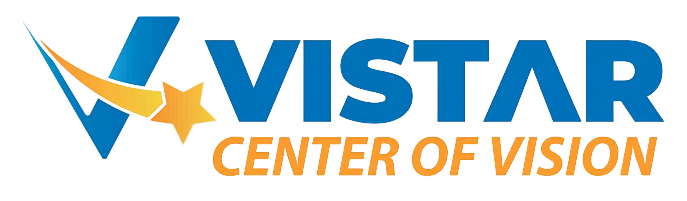

## Tentang Vi Start

Platform Education Technology yang menggabungkan VI(6) unsur “Si” baik Kompetisi, Kompetensi, Konferensi, Literasi, Prestasi, dan Sertifikasi. Yang beralamat di Jl. Mawar No.58, Sari Rejo, Kec. Medan Polonia, Kota Medan, Sumatera Utara 20219

## Produk & Layanan
- Ujian Tryout Berbasis CAT/CBT

## Author & Kontribusi

- Dr. Dicky Nofriansyah, S.Kom.,M.Kom.,CITP
- Ahmad Yusri
- Rahmadsyah
- Qori Chairawan

## Versi Web

Production 1.0.1

## Pembaruan & Perbaikan

- Memperbaiki optimasi loading setiap halaman aplikasi
- Menambahkan fitur pembayaran menggunakan QRIS

## License & Copyright

Hak Cipta &copy; Vi Star 2024
